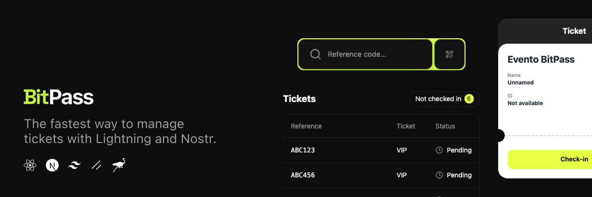

# Welcome to BitPass

## What is BitPass?

BitPass is a Bitcoin-native ticketing platform that empowers event organizers to create, sell, and manage tickets using Lightning Network payments and Nostr technology. We're building the future of event ticketing with a focus on privacy, sovereignty, and censorship resistance.

Our mission is to provide a seamless ticketing experience that leverages Bitcoin's security and Nostr's decentralized communication to create a trustless ecosystem for event organizers and attendees.

## Our Repositories

- [**BitPass App**](https://github.com/bitpass-live/bitpass-app) - Next.js frontend application for event creation, ticket sales, and check-ins
- [**BitPass API**](https://github.com/bitpass-live/bitpass-api) - Backend API services for handling payments, ticket verification, and data management

## How It Works

It's super easy:

1. **Connect**: Sign in with your email or Nostr keys to access the BitPass platform
2. **Create**: Set up your event with custom ticket types, pricing, and details
3. **Sell**: Share your event link and accept Bitcoin Lightning payments instantly
4. **Check-in**: Scan attendee QR codes or verify ticket references at the venue

## Key Features

- **⚡ Lightning-Fast Payments**: Accept Bitcoin payments via Lightning Network with instant confirmations
- **🔑 Nostr Authentication**: Use your existing Nostr keys for secure, self-sovereign identity
- **📱 Mobile-First Design**: Optimized experience for both organizers and attendees on any device
- **🔒 Privacy-Focused**: Minimal data collection, focused on protecting user privacy
- **🌐 Censorship-Resistant**: Built on decentralized technologies to prevent platform risk

## Technology Stack

BitPass is built using modern technologies with a focus on performance, security, and user experience:

- **Frontend**: Next.js, React, TypeScript, Tailwind CSS
- **Backend**: Node.js, Express, TypeScript
- **Payments**: Lightning Network
- **Authentication**: Nostr protocol, Email OTP
- **Data Storage**: PostgreSQL
- **Deployment**: Docker

## How You Can Contribute

We welcome contributions from developers, designers, writers, and Bitcoin enthusiasts of all kinds!

### For Coders:

- Check out our repositories, pick an issue labeled 'help wanted' or 'good first issue', and start coding!
- Adhere to the coding standards and guidelines provided in our [CONTRIBUTING.md](CONTRIBUTING.md)
- Write clear, commented code and ensure it comes with tests

### For Non-Coders:

- Participate in discussions to suggest features or improvements
- Help with co-marketing and business development efforts
- Test the platform and report bugs or usability issues
- Engage with us on social media and spread the word about BitPass
- Organize events using BitPass and provide feedback

## Roadmap

We're constantly improving BitPass with new features and enhancements:

- **Q2 2025**: Initial MVP launch with core ticketing functionality
- **Q3 2025**: Enhanced Lightning Network integration and Nostr authentication
- **Q4 2025**: Mobile app development and advanced analytics for organizers
- **Q1 2026**: Multi-signature support and enhanced privacy features
- **Q2 2026**: Decentralized identity verification and ticket transferability

## Community & Support

- [**Website**](https://bitpass.live)
- [**Documentation**](https://docs.bitpass.live)
- [**Twitter**](https://twitter.com/bitpasslive)

## Contributing to BitPass

We believe in collaboration and open-source. If you're interested in contributing to BitPass, check out our [Contribution Guidelines](profile/CONTRIBUTING.md).

## License

BitPass is open source software licensed under the [MIT License](LICENSE.md).
